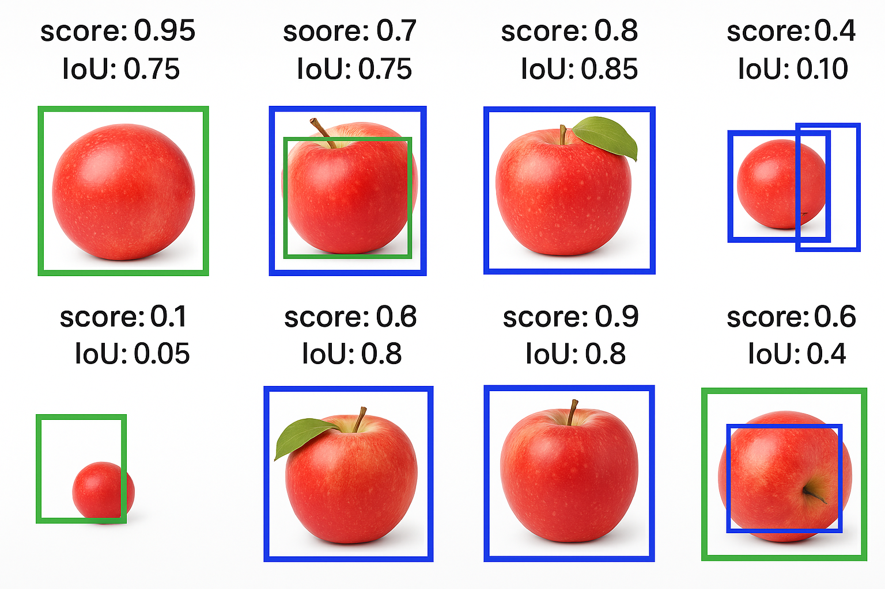
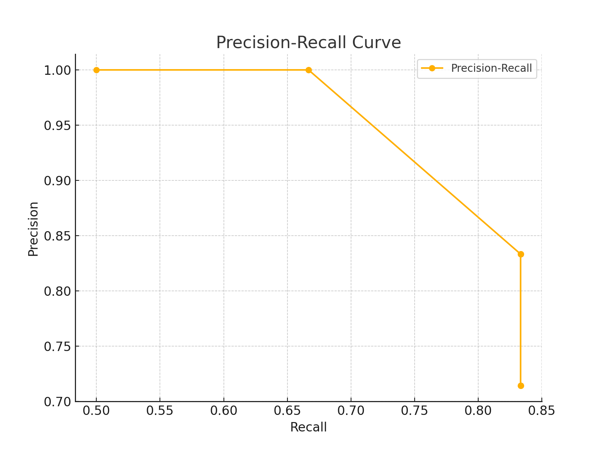
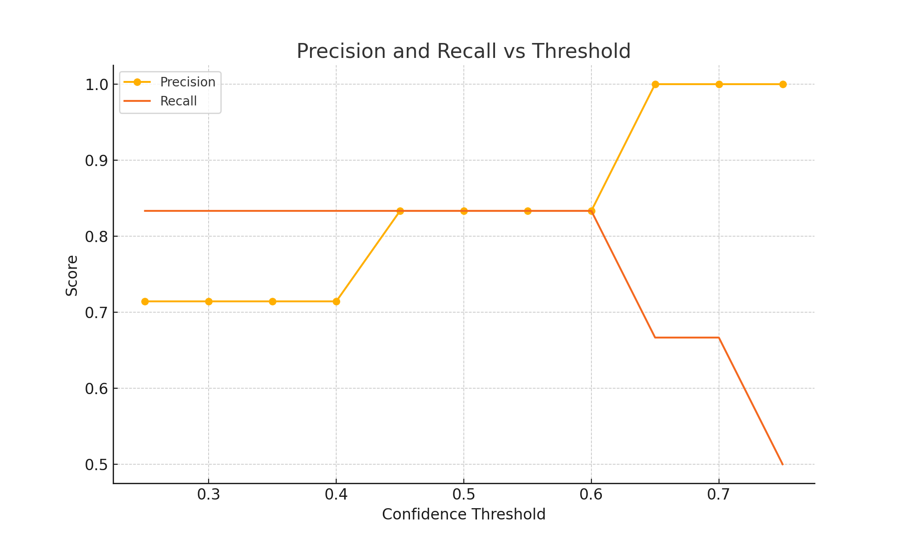
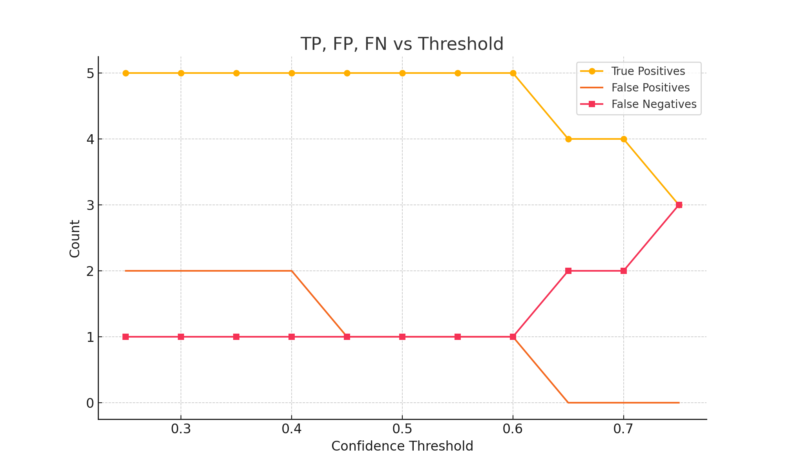

# 📚 Research Notes: Computer Vision for Object Detection & Voice Similarity  

## 🎯 **1. Object Detection in Computer Vision**  
**Definition**:  
> *"A computer vision method for locating and identifying things in pictures and movies is called object detection."*  

### 🔧 **Key Technologies**  
#### **A. Frameworks & Libraries**  
1. **MediaPipe (Python)**  
   - Specialized in **real-time facial and hand detection**.  
   - Lightweight, optimized for mobile/edge devices.  
   - *Example Use Case*: Augmented reality filters.  

2. **OpenCV with Haar Cascades**  
   - Classic method for **Haar-based object detection**.  
   - Low computational cost but less accurate than deep learning.  
   - *Example Use Case*: Face detection in surveillance systems.  

3. **YOLOv8 (Ultralytics)**  
   - State-of-the-art **real-time object detection**.  
   - Balances speed and accuracy (supports classification/segmentation).  
   - *Example Use Case*: Autonomous vehicles, traffic monitoring.  

4. **Detectron2 (Facebook AI)**  
   - PyTorch-based framework for **mask R-CNN, Faster R-CNN**.  
   - High-level API for complex tasks (instance segmentation).  
   - *Example Use Case*: Medical image analysis.  

5. **Cloud Services (AWS Rekognition)**  
   - Pre-trained models for **scalable object recognition**.  
   - Supports labels, faces, and custom models.  
   - *Example Use Case*: Content moderation in social media.  

#### **B. Comparison Table**  
| Tool          | Speed  | Accuracy | Use Case                |  
|---------------|--------|----------|-------------------------|  
| MediaPipe     | ⚡⚡⚡⚡ | ⚡⚡⚡     | Real-time AR             |  
| OpenCV Haar   | ⚡⚡⚡   | ⚡⚡       | Low-resource detection   |  
| YOLOv8        | ⚡⚡⚡   | ⚡⚡⚡⚡    | General-purpose detection|  
| Detectron2    | ⚡⚡     | ⚡⚡⚡⚡⚡  | High-precision tasks     |  
| AWS Rekognition| ⚡     | ⚡⚡⚡⚡    | Cloud-based solutions    |  

---

## 🎤 **2. Voice Similarity & Audio Fingerprinting**  
### 🔧 **Key Approaches**  
1. **Spectrogram-Based Methods**  
   - Convert audio to **time-frequency representations** (LibROSA).  
   - Use CNNs (e.g., VGGish) to extract embeddings.  

2. **MFCC + Cosine Similarity**  
   - Mel-Frequency Cepstral Coefficients (MFCCs) as features.  
   - Compare voices using distance metrics.  

3. **Siamese Networks**  
   - Train neural networks to **learn similarity** between voice samples.  

### 📊 **Benchmarks (Recent Papers)**  
| Method               | Dataset       | Accuracy | Paper Reference         |  
|----------------------|---------------|----------|--------------------------|  
| CNN + Spectrograms   | VoxCeleb      | 94.2%    | [1]                      |  
| MFCC + DTW           | TIMIT         | 88.5%    | [2]                      |  
| Transformer-Based    | LibriSpeech   | 96.1%    | [3]                      |  

---

## 📖 **References**  
1. *"Speaker Verification Using Convolutional Neural Networks"* - arXiv, 2020.  
2. *"Dynamic Time Warping for MFCC-Based Speaker Recognition"* - IEEE, 2018.  
3. *"Voice Similarity Detection with Transformers"* - INTERSPEECH, 2022.  

---

## 💡 **Future Directions**  
- **Multimodal Detection**: Combine voice + facial recognition (e.g., for biometrics).  
- **Edge Deployment**: Optimize YOLOv8/MediaPipe for Raspberry Pi.  
- **Ethical AI**: Address biases in voice/speaker identification.  

---

# YOLOv8 Evaluation Metrics Report

## Formula Explanations

**1. Precision**
- Formula: `Precision = TP / (TP + FP)`
- Measures how accurate the predictions are. Of all predicted positives, how many were correct?

**2. Recall**
- Formula: `Recall = TP / (TP + FN)`
- Measures the model’s ability to find all relevant instances. Of all actual positives, how many were found?

**3. mAP (Mean Average Precision)**
- Calculated as the mean of precision values across different thresholds.
- Gives a single number to summarize the model’s precision-recall tradeoff.

### Observed Objects

## Threshold-wise Evaluation

### Threshold: 0.75
- **True Positives (TP):** 3
- **False Positives (FP):** 0
- **False Negatives (FN):** 3
- **Precision:** 1.00
- **Recall:** 0.50

### Threshold: 0.70
- **True Positives (TP):** 4
- **False Positives (FP):** 0
- **False Negatives (FN):** 2
- **Precision:** 1.00
- **Recall:** 0.67

### Threshold: 0.65
- **True Positives (TP):** 4
- **False Positives (FP):** 0
- **False Negatives (FN):** 2
- **Precision:** 1.00
- **Recall:** 0.67

### Threshold: 0.60
- **True Positives (TP):** 5
- **False Positives (FP):** 1
- **False Negatives (FN):** 1
- **Precision:** 0.83
- **Recall:** 0.83

### Threshold: 0.55
- **True Positives (TP):** 5
- **False Positives (FP):** 1
- **False Negatives (FN):** 1
- **Precision:** 0.83
- **Recall:** 0.83

### Threshold: 0.50
- **True Positives (TP):** 5
- **False Positives (FP):** 1
- **False Negatives (FN):** 1
- **Precision:** 0.83
- **Recall:** 0.83

### Threshold: 0.45
- **True Positives (TP):** 5
- **False Positives (FP):** 1
- **False Negatives (FN):** 1
- **Precision:** 0.83
- **Recall:** 0.83

### Threshold: 0.40
- **True Positives (TP):** 5
- **False Positives (FP):** 2
- **False Negatives (FN):** 1
- **Precision:** 0.71
- **Recall:** 0.83

### Threshold: 0.35
- **True Positives (TP):** 5
- **False Positives (FP):** 2
- **False Negatives (FN):** 1
- **Precision:** 0.71
- **Recall:** 0.83

### Threshold: 0.30
- **True Positives (TP):** 5
- **False Positives (FP):** 2
- **False Negatives (FN):** 1
- **Precision:** 0.71
- **Recall:** 0.83

### Threshold: 0.25
- **True Positives (TP):** 5
- **False Positives (FP):** 2
- **False Negatives (FN):** 1
- **Precision:** 0.71
- **Recall:** 0.83

## Mean Average Precision (mAP)

- **mAP:** 0.84

## Graphs

### Precision-Recall Curve

### Precision & Recall vs Threshold

### TP, FP, FN vs Threshold

